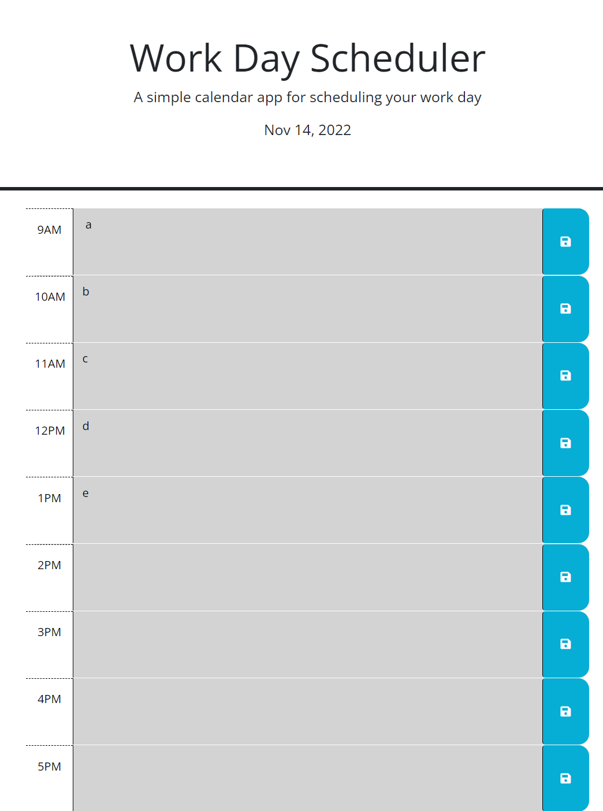

# Javascript Quiz

## Description

A calendar for a eight hour workday. Users can add descriptions to each hour block and save them to local storage for later.

## Usage

Type in todos for each hour and press the save button to save them to local storage. The current date is displayed at the top of the page. The time-blocks will change colors depending on the hour.

https://github.com/JakobDayton/work-day-scheduler

https://jakobdayton.github.io/quiz-project/

## Credits

https://stackoverflow.com/questions/22828474/how-to-get-number-from-the-id-value